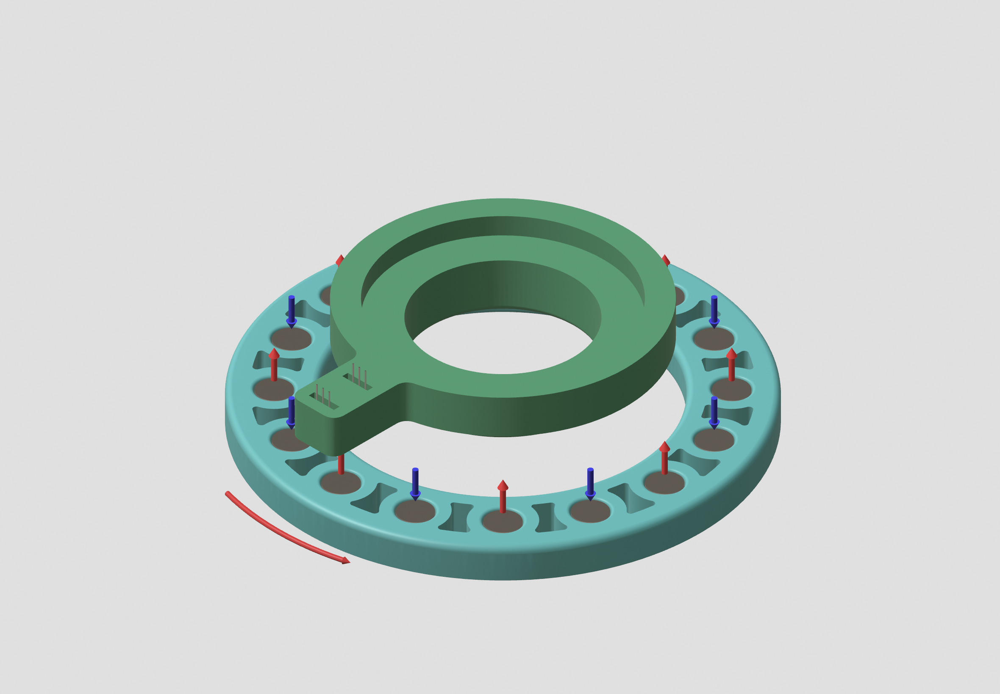
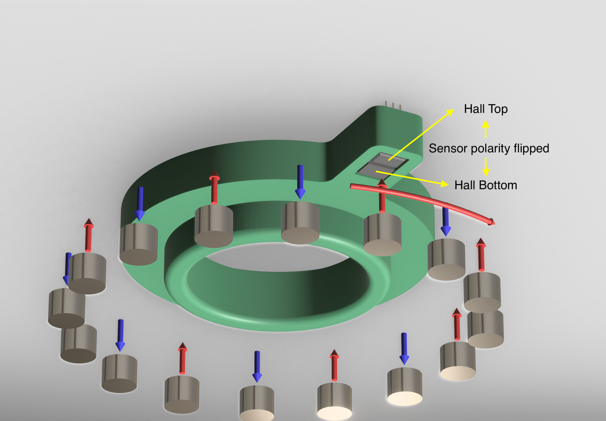

# Arduino Hall Effect speed sensor

This repo is a part of a dolly-cart combo project done for APSC 140 at Capilano University. See the Concept_images folder for more info.

A wheel speed sensor was constructed using alternating polarity magnets (shown by arrow color and direction), along with two adjacent opposite-facing hall effect sensors. The speed is calculated as some constant multiplied by the time between detection events. The setup is as follows:

The hall effect sensor layout is demonstrated below:

The blue part is attached to the wheel, and the green part is attached to the base of the axle. 

When the sensor pair is directly on top of a magnet, only one of the sensors will go LOW, leaving the other sensor unchanged. Through this logic, we can calculate a speed measurement by watching for a Hall_TOP = LOW followed by a Hall_BOTTOM = LOW (or vice versa). This allows for  much more consistent speed measurements, and in the process eliminating a key issue:

> For the case of non-alternating magnet polarity, if a single magnet repeatedly passes over the sensor like a pendulum, a false velocity will be reported.

Aditionally, exponential smoothing / low-pass filtering is applied to the velocity, along with a non-linear decay function if no new sensor updates have been received in an arbitrary amount of time.